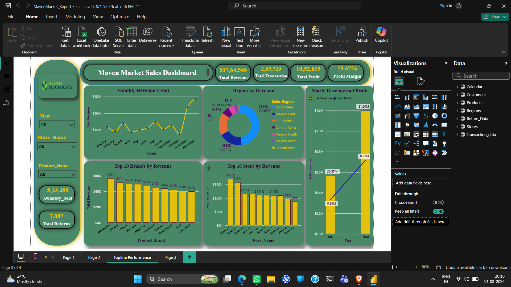

# Maven Market Sales Dashboard 📊

An interactive Power BI dashboard developed using the Maven Market dataset to analyze sales performance, revenue, profitability, transactions, returns, products, stores, and regional performance.

## 🎯 Project Objective

The objective of this project is to transform raw Maven Market data into an interactive business intelligence dashboard that helps users understand:

- Overall sales performance
- Revenue and profit trends
- Product and brand performance
- Store performance
- Regional revenue distribution
- Transaction and return behavior
- Profitability and profit margin
- Year-over-year performance

## 🛠️ Tools & Technologies

- Power BI
- Power Query
- DAX
- Data Modeling
- Data Visualization

## 📂 Dataset

The project uses the Maven Market dataset containing:

- Calendar
- Customers
- Products
- Region
- Return Data
- Stores
- Transaction Data

## 🔄 Data Preparation

Power Query was used for:

- Combining 1997 and 1998 transaction CSV files
- Cleaning and transforming data
- Changing data types
- Creating calculated columns
- Handling missing/null values
- Extracting store area codes
- Creating date-related columns
- Preparing tables for analysis

## 📐 Data Modeling

A relational data model was created between the fact and dimension tables.

### Main Tables

- `Transaction_Data`
- `Return_Data`
- `Calendar`
- `Products`
- `Customers`
- `Stores`
- `Region`

## 🧮 DAX Measures

Some of the major DAX measures created include:

- Quantity Sold
- Quantity Returned
- Total Transactions
- Total Returns
- Return Rate
- Weekend Transactions
- % Weekend Transactions
- All Transactions
- All Returns
- Total Revenue
- Total Cost
- Total Profit
- Profit Margin
- Unique Products
- YTD Revenue
- 60-Day Revenue
- Last Month Transactions
- Last Month Revenue
- Last Month Profit
- Last Month Returns
- Revenue Target

## 📊 Dashboard Features

The dashboard includes:

### KPI Cards
- Total Revenue
- Total Transactions
- Total Profit
- Profit Margin
- Quantity Sold
- Total Returns

### Visualizations

- Monthly Revenue Trend
- Revenue by Region
- Yearly Revenue & Profit
- Top 10 Brands by Revenue
- Top 10 Stores by Revenue
- Interactive slicers for Year, Store, and Product

## 💡 Key Business Insights

The dashboard can be used to identify:

- High-performing product brands
- Top-performing stores
- Regional revenue contribution
- Monthly revenue trends
- Profitability trends
- Changes in revenue and profit over time
- Overall return performance

## 🎨 Dashboard Design

The dashboard was designed with a focus on:

- Clean visual layout
- Interactive filtering
- KPI-driven analysis
- Consistent color theme
- Easy-to-understand business insights

## 📸 Dashboard Preview

## 👨‍💻 Author

**Sambhaji Yadav**

Aspiring Data Analyst | Power BI | SQL | Excel | Python
